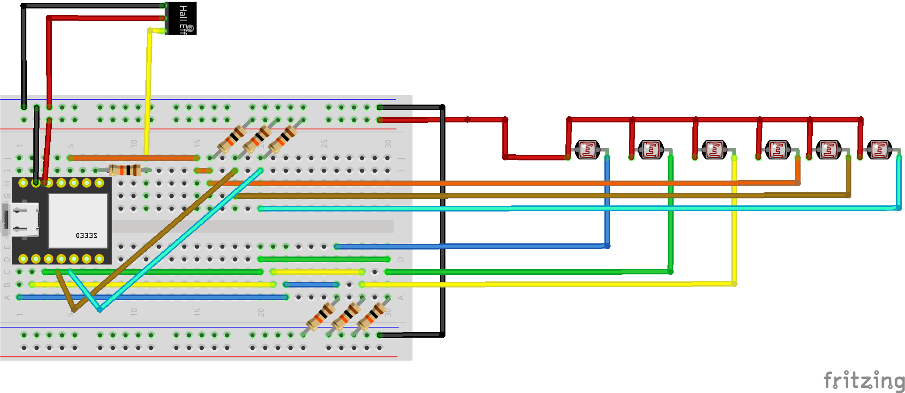

# DVDW23
set-up voor **dag van de wetenschap, editie 2023**

# Set-up
* **Six GL5516LDR photoresistors** are connected to the analog pins of a Seeed Studio XIAO ESP32S3
* ~~**One HALL sensor** is connected to the digital pin of the Seeed Studio XIAO ESP32S3~~ (omitted due to time issues)
* The ESP32S3 reads and sends a values of the photoresistors to the **serial monitor** every 10 milliseconds, in a format that can be read by **Protopie Connect**
* **Variables in Protopie**: sensor1, sensor2, sensor 3, sensor4, sensor5, sensor6, hall, frequency
* **Physical set-up**: A bike is put on a training stand and put in front of a table with 6 cups that cover the light sensors. Behind the table, a shortthrow projector project the protopie screen with a movie of a cycling person and 6 choices are shown (one behind each cup). ~~THe hall sensor is connected to the frame and a magnet to the crank. When you start cycling, the movie becomes visible~~. The person on the bike gets a nerf gun and is asked to cycle and shoot the cup standing before their choice. When hit, the light sensor detects light and triggers an animation on the projection. ~~At the same time, a signal gets send to a database to capture that vote~~ (omitted due to time issues).
* by Bas Baccarne

  # Files
  - [Arduino script](DVDW23.ino)
  - [Pie file](https://drive.google.com/file/d/13DgN5ienUSCBkp2FckoTW8GcOmpYX-O_/view?usp=sharing)
  - [CAD file case](https://a360.co/3R8AWaR)
 
  # Hardware list
  - Sensors: 6x GL5516LDR photoresistors
  - Microcontroller: Seeed Studio XIAO ESP32S3
  - Broadboard
  - Foam coasters
  - Support material
  - Wires
  - 6x 10k Ohm resistors
  - 3D printed case
  - ShortThrow projector (e.g. LG PF1000U Ultra Short Throw Beamer)
  - Laptop with protopie connect
  - Nerfguns
  - Nerfgun ammo
  - (Cargo) Bike
  - Bycicle rollers

# Wires

# Open Nice To Haves
- [ ] New movies
- [ ] Pedal reveal / interaction
- [ ] Send vote to database
